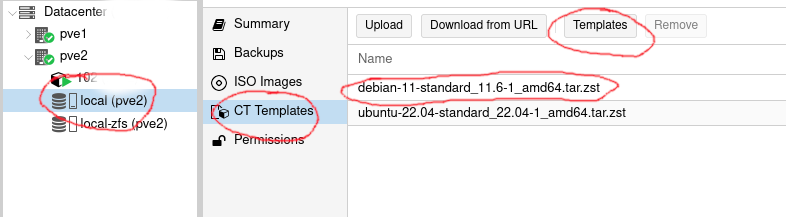
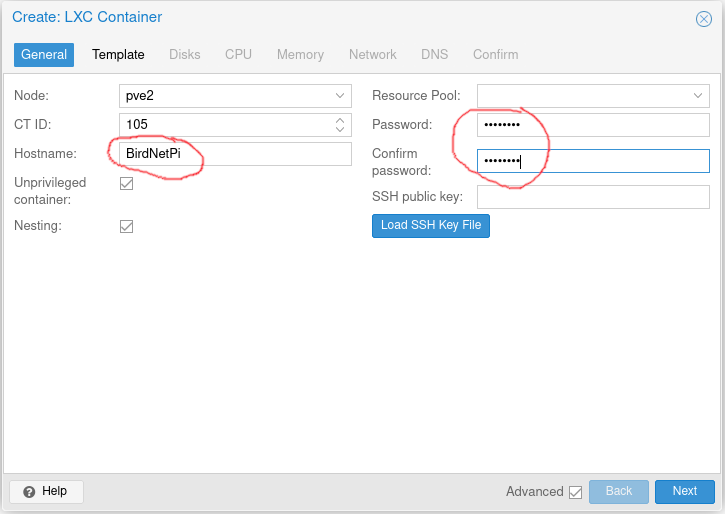
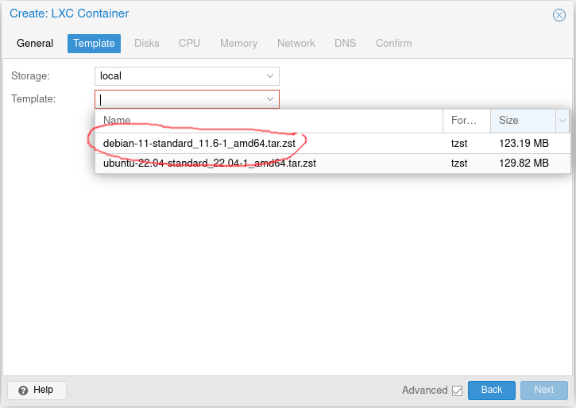
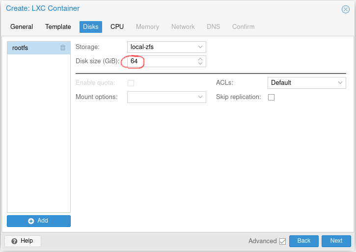
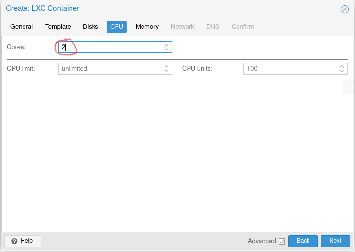
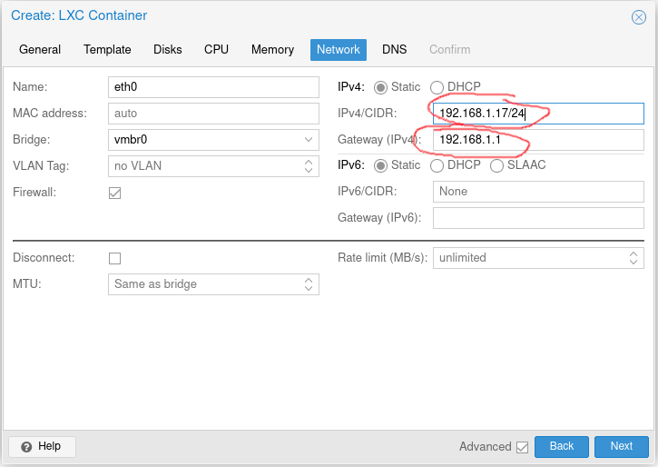
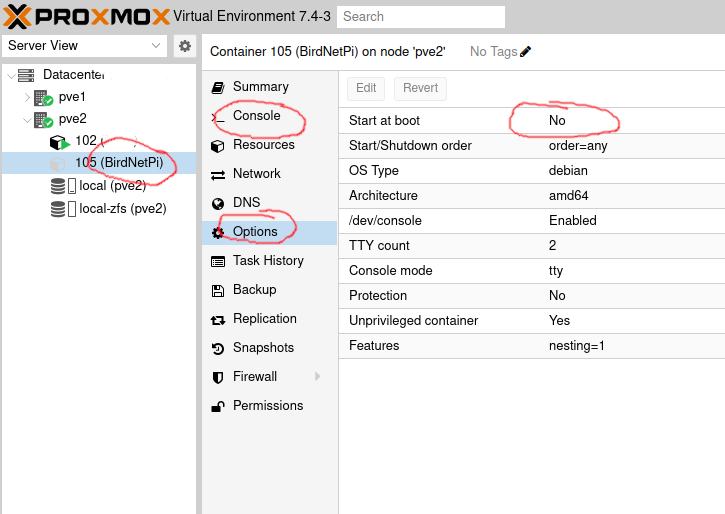

# How to setup BirdNET-Pi in a Proxmox Container

## CT is short for container

1. [Setup your proxmox server](https://www.proxmox.com/en/proxmox-ve/get-started)
2. Click on your "local (pve)" disk >> Click "CT Templates" >> Click the "Templates" button >> download the Debian 11 template. 
3. Add "Hostname" >> Give a Password and confirm password. 
4. Select the Debian 11 template. 
5. Add your disk size. 
6. Add how many CPU cores you want to use. 
7. Add how much Memory you want to use. 
8. Give you CT a IP or choose DHCP to let your router choose. 
9. Click Next and Confirm/Finish
10. Click on the "BirdNETPi" CT you created and under "Options" , "Edit" if you want your CT to start at boot. Then Click Console and the Start button to start your CT. 
11. Login with "root" and the password you set earlier.
12. Enter the following commands into the console CLI 
```
apt update
apt upgrade -y
apt install curl sudo -y
add user pi
usermod -aG sudo pi
su pi
curl -s https://raw.githubusercontent.com/MatthewBCooke/BirdNET-Pi/debian/newinstaller.sh | bash
```
13. Then continue with step #21 [here](https://github.com/mcguirepr89/BirdNET-Pi/wiki/Installation-Guide) 
14. And add your audio network feed under Tools >> Settings >> Advanced Settings
